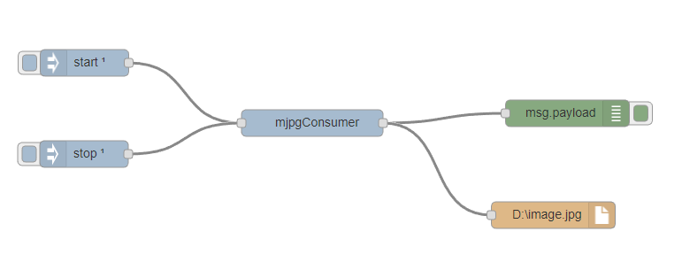

# node-red-contrib-mjpgcamera

Node-Red nodes for mjpg-streamer.

Visit https://github.com/jacksonliam/mjpg-streamer for more details.


## mjpg-consumer

A node that consumes a mjpeg stream and outputs the latest saved frame as buffer

<p><b>Stream</b> should be the address of the stream</p>
<p><b>Streaming interval</b> should be the number of seconds between buffer outputs</p>

<p>To enable output send "start" as payload (Can use an inject node or a dashboard switch). To disable, send "stop".</p>

Import the JSON below after installing the node to output the frame buffer to debug node and save frame as file. Edit mjpgConsumer to match your values (stream uri and output interval) and the file node to match the location to save the stream to as .JPG.

```json
[{"id":"6d6c7312.2ff31c","type":"mjpg-consumer","z":"ddc693d5.dbc2a","name":"MjpgConsumer","stream":"http://192.168.0.104:8080/?action=stream","interval":"2","x":517,"y":134,"wires":[["18a0339c.da93ec","657e92c5.2219fc"]]},{"id":"68133e2.b94f7c","type":"inject","z":"ddc693d5.dbc2a","name":"Start Consumer","topic":"","payload":"start","payloadType":"str","repeat":"","crontab":"","once":true,"x":218,"y":103,"wires":[["6d6c7312.2ff31c"]]},{"id":"11674ce7.4dfc33","type":"inject","z":"ddc693d5.dbc2a","name":"Stop Consumer","topic":"","payload":"stop","payloadType":"str","repeat":"","crontab":"","once":false,"x":216,"y":170,"wires":[["6d6c7312.2ff31c"]]},{"id":"18a0339c.da93ec","type":"debug","z":"ddc693d5.dbc2a","name":"","active":true,"console":"false","complete":"false","x":756,"y":133,"wires":[]},{"id":"657e92c5.2219fc","type":"file","z":"ddc693d5.dbc2a","name":"Camera Capture","filename":"E:\capture.jpg","appendNewline":false,"createDir":false,"overwriteFile":"true","x":767,"y":199,"wires":[]}]
```


</img>